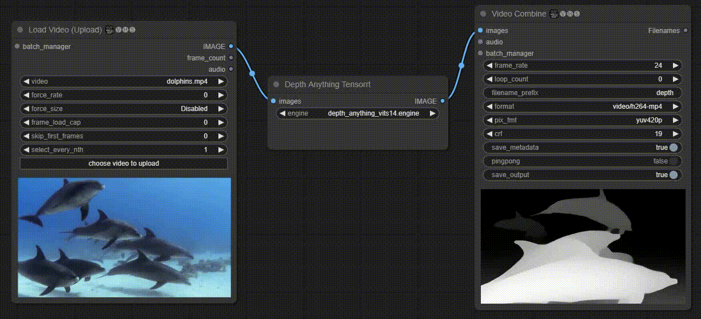

<div align="center">

# ComfyUI Depth Anything TensorRT

[](https://www.python.org/downloads/release/python-31012/)
[](https://developer.nvidia.com/cuda-downloads)
[](https://developer.nvidia.com/tensorrt)
[](https://github.com/spacewalk01/depth-anything-tensorrt/blob/main/LICENSE)

</div>

<p align="center">
  
</p>

This repo provides a ComfyUI Custom Node implementation of the [Depth-Anything-Tensorrt](https://github.com/spacewalk01/depth-anything-tensorrt) in Python for ultra fast depth map generation

## ⏱️ Performance

[Original Source](https://github.com/spacewalk01/depth-anything-tensorrt/blob/main/README.md#%EF%B8%8F-performance)
| Device | Model | Model Input (WxH) | Image Resolution (WxH)|Inference Time(ms)|
|:---------------:|:------------:|:------------:|:------------:|:------------:|
| RTX4090 | Depth-Anything-S |518x518 | 1280x720 | 3 |
| RTX4090 | Depth-Anything-B |518x518 | 1280x720 | 6 |
| RTX4090 | Depth-Anything-L |518x518 | 1280x720 | 12 |

## 🚀 Installation

Navigate to the ComfyUI `/custom_nodes` directory

```bash
git clone https://github.com/yuvraj108c/ComfyUI-Depth-Anything-Tensorrt.git
cd ./ComfyUI-Depth-Anything-Tensorrt
pip install -r requirements.txt
```

## 🛠️ Building Tensorrt Engine

1. Download one of the available [onnx models](https://huggingface.co/yuvraj108c/Depth-Anything-Onnx/tree/main). Modify and run the following command accordingly

   ```bash
   trtexec --onnx=depth_anything_vitl4.onnx --saveEngine=depth_anything_vitl14.engine --fp16
   ```

2. Place the engines inside ComfyUI `/models/depth_trt_engines` directory

## 🤖 Environment tested

- Ubuntu 22.04 LTS, Cuda 12.3, Tensorrt 8.6.1, A10G GPU
- Windows (Not tested)

## 👏 Credits

- [spacewalk01/depth-anything-tensorrt](https://github.com/spacewalk01/depth-anything-tensorrt)
- [martenwikman/depth-anything-tensorrt-docker](https://github.com/martenwikman/depth-anything-tensorrt-docker)
